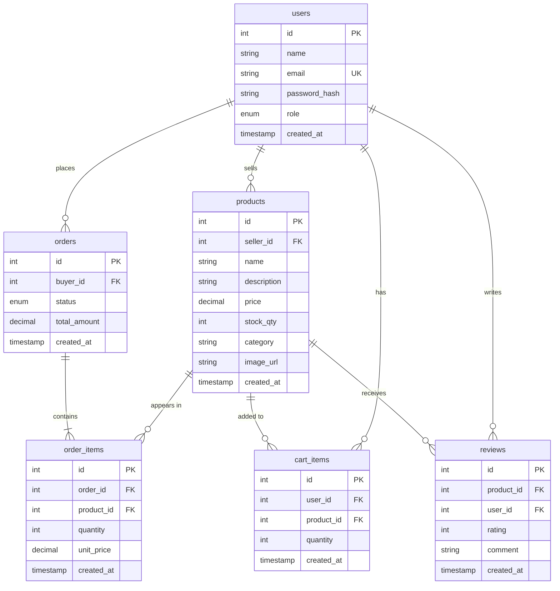

# ER Diagram (D1)

```mermaid
erDiagram
  users ||--o{ products : sells
  users ||--o{ orders : places
  users ||--o{ cart_items : has
  users ||--o{ reviews : writes
  products ||--o{ order_items : "appears in"
  products ||--o{ cart_items : "added to"
  products ||--o{ reviews : receives
  orders ||--|{ order_items : contains
  users { int id PK
    string name
    string email UK
    string password_hash
    enum role
    timestamp created_at }
  products { int id PK
    int seller_id FK
    string name
    string description
    decimal price
    int stock_qty
    string category
    string image_url
    timestamp created_at }
  orders { int id PK
    int buyer_id FK
    enum status
    decimal total_amount
    timestamp created_at }
  order_items { int id PK
    int order_id FK
    int product_id FK
    int quantity
    decimal unit_price
    timestamp created_at }
  cart_items { int id PK
    int user_id FK
    int product_id FK
    int quantity
    timestamp created_at }
  reviews { int id PK
    int product_id FK
    int user_id FK
    int rating
    string comment
    timestamp created_at }
```
